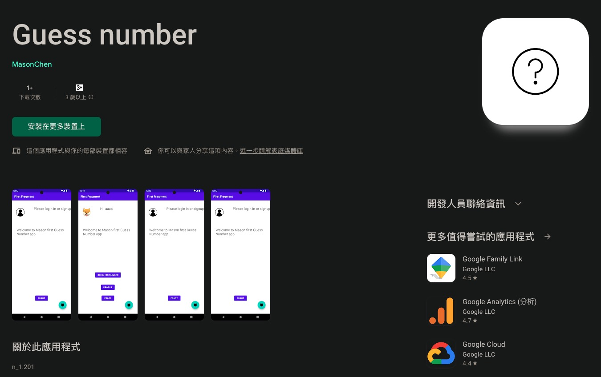

# 應用開發筆記

### GuessNumber:

GuessNumber 是一個由作者在閒暇時間開發的小程式，主要用於實作新學習的技術。以下是專案的主要特點：

* 架構: GuessNumber 使用 MVVM 架構，以確保程式碼的組織和可測試性。
* 會員機制: 串接 Firebase Authentication 實現會員機制，使用者可以註冊和登錄帳號。
* 資料存儲: 串接 Firebase Realtime Database，使用者可以登錄後更改暱稱和圖像。
* 猜數字遊戲: 使用者可以進入猜數字遊戲，遊戲頁面提供猜數字按鈕，使用ViewModel搭配LiveData實作，並使用DataBinding即時更新UI介面。
* 猜對次數記錄: 遊戲結束後，使用者可以輸入暱稱並將猜對的次數保存到資料庫，使用 Room 處理資料庫操作。
* 單元測試: 為了確保程式碼的品質，完成了 GuessNumberViewModel 的單元測試。
* 廣告支援: 廣告為目前大部分免費應用營收很重要的項目之一，GuessNumber 串接 Firebase ADMOB，在每個頁面提供廣告橫幅，並提供廣告測試按鈕 (ADMOB TEST按鈕)。
* Youbike2.0: 作者自己常用的小功能，透過Retrofit2.0串接政府開源API，目前提供新北市的Youbike2.0即時狀態，以Retrofit搭配Kotlin Flow實作。

在Github上查看詳細的程式碼和專案資訊:

[https://github.com/chen1080430/GuessNumberActivity](https://github.com/chen1080430/GuessNumberActivity)\

[https://play.google.com/store/apps/details?id=com.mason.myapplication](https://play.google.com/store/apps/details?id=com.mason.myapplication)



<figure><figcaption></figcaption></figure>

### MessageSync:

MessageSync 是一個簡訊同步應用，讓使用者可以即時將收到的簡訊轉送到 Telegram 或 LineNotify 上，方便在不同裝置上查看簡訊內容。以下是專案的主要特點：

* 簡訊同步: 使用 Telegram API 或 LineNotify API 實現簡訊轉送功能，讓使用者能夠隨時查看簡訊。
* 設定管理: 提供同步設定和通知設定，讓使用者自訂簡訊同步和通知的方式。

&#x20;[GitHub 上的 MessageSync 專案](https://github.com/chen1080430/MessageSync) 查看更多專案詳細資訊。

[https://play.google.com/store/apps/details?id=com.mason.messagesync](https://play.google.com/store/apps/details?id=com.mason.messagesync)



<figure><figcaption></figcaption></figure>

###

### TouristAttraction(上架審核階段):

Tourist Attraction 是一個介紹大台北地區景點的應用程式，根據 [https://www.travel.taipei/open-api/zh-tw/Attractions/All](https://www.travel.taipei/open-api/zh-tw/Attractions/All) 實作，目的是取得選取語系的全部景點資訊並顯示在主頁面上。\
以下是專案的主要特點：

* 架構: 使用 MVVM 架構，確保程式碼的組織和可測試性。
* 資料來源: 透過 Retrofit 串接開放 API，獲取選取語系的全部景點資訊。
* 主頁面: 使用 RecyclerView 搭配 Paging3 實作，以提高資料載入和顯示的效率。
* 景點詳細資訊: 點擊每個景點後，將打開新的頁面顯示詳細資訊，同時可以透過 URL 開啟 WebView 瀏覽器顯示官方網頁。
* 架構元素: 使用 Navigation 管理 Fragment 之間的導航，使用 SafeArgs 傳遞資料，並使用 ViewBinding 和 DataBinding 進行視圖的綁定。
* 非同步處理: 使用 Flow 來取得景點資訊，確保異步操作和反應式編程的能力。

歡迎至 [GitHub 上的 TouristAttraction 專案](https://github.com/chen1080430/TouristAttraction) 查看更多專案詳細資訊。
